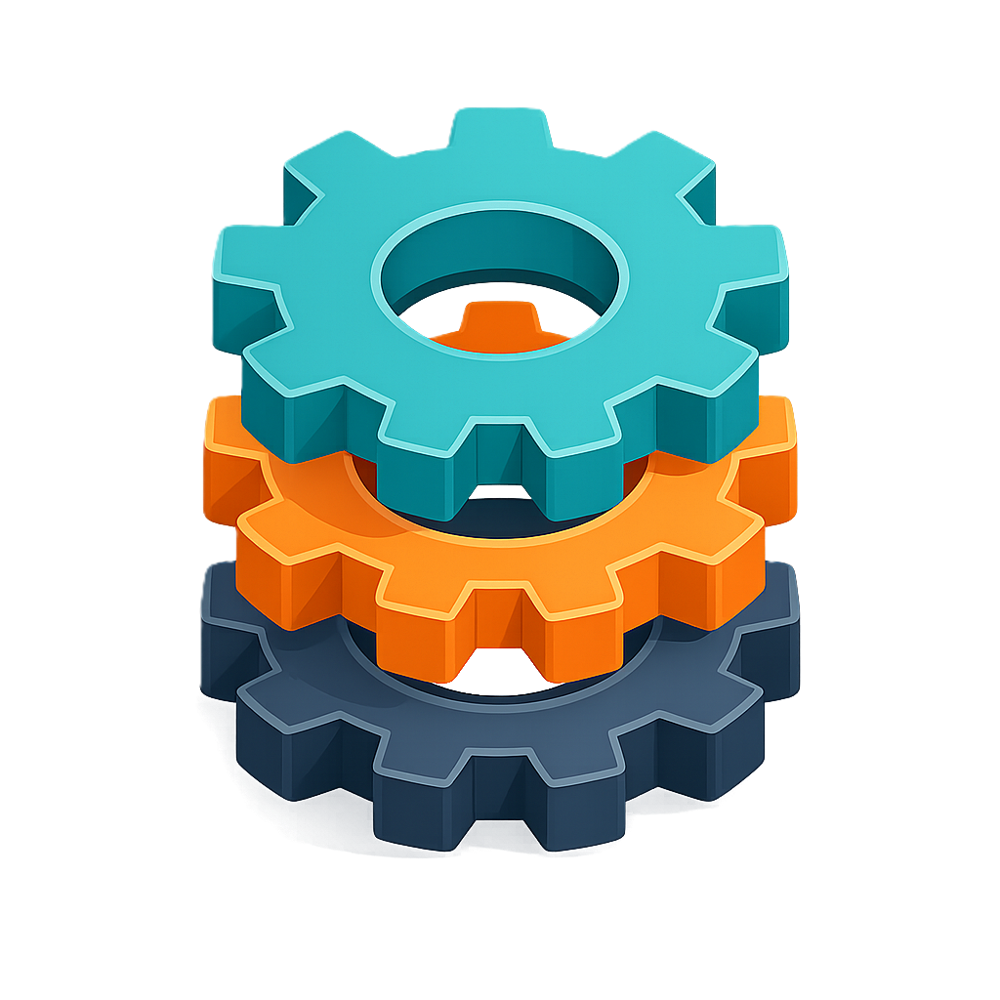
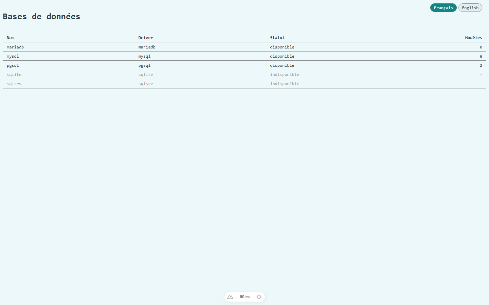
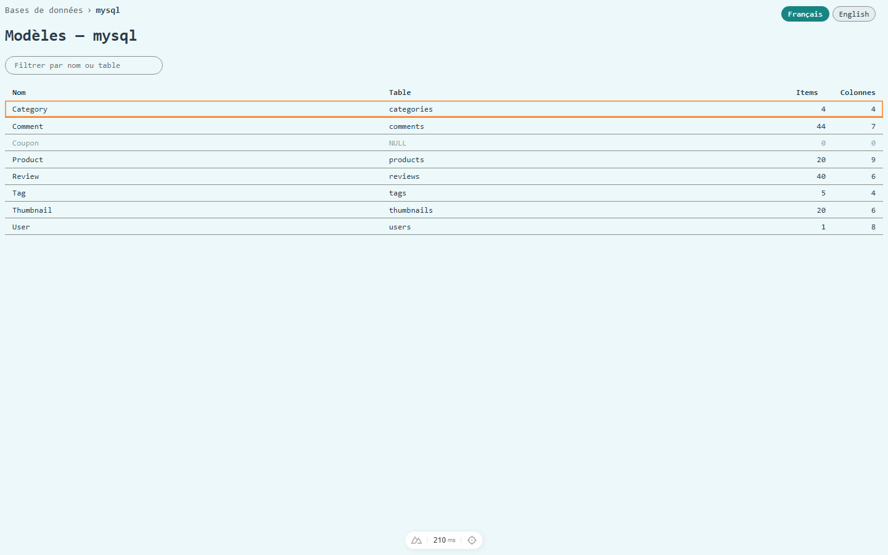
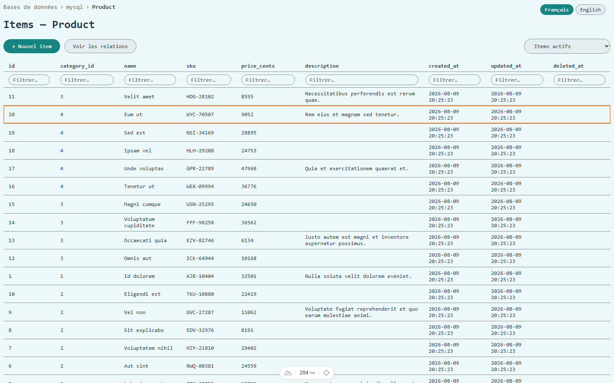
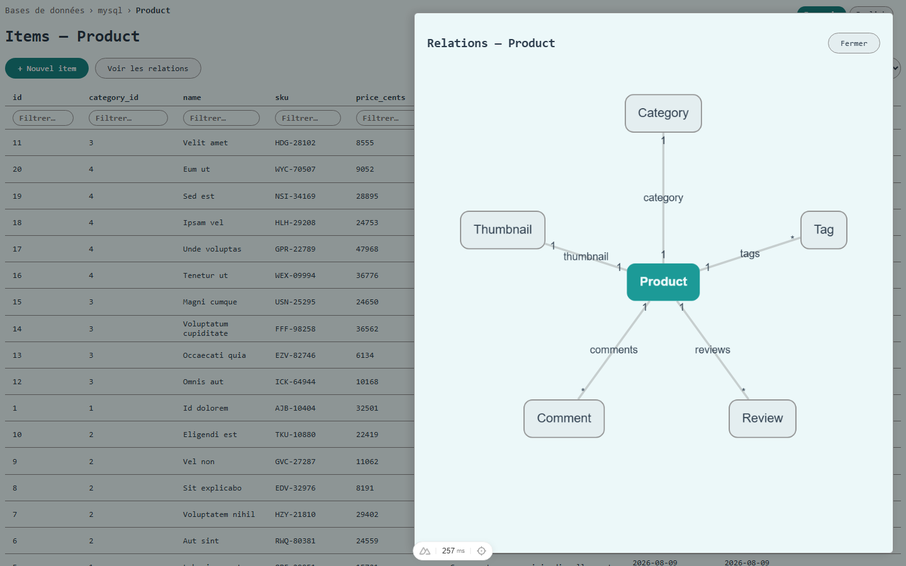
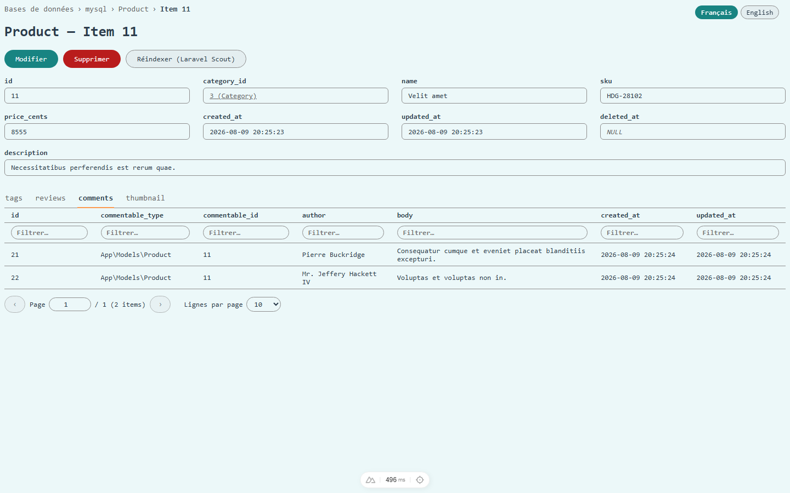

<h1 align="center">
    <br />
    Modelbase
</h1>

Plug-in Laravel de gestion des données d'une application Laravel : parcours des connexions de bases de données, des modèles Eloquent qu'elles contiennent, et de leurs items — sans données propres au plug-in (tout est introspecté dynamiquement depuis l'application hôte).

**Ce n'est pas une base de données mais une base de modèles.**  
**This is not a database but a modelbase.**

</td>
</tr>
</table>

<table border="0" cellspacing="0" cellpadding="0" style="border:none;border-collapse:collapse;">
<tr style="border:none;">
<td width="50%" style="border:none;"></td>
<td width="50%" style="border:none;"></td>
</tr>
<tr style="border:none;">
<td style="border:none;">Connexions de bases de données, avec statut et nombre de modèles résolus dynamiquement</td>
<td style="border:none;">Modèles Eloquent d'une connexion, avec table, nombre d'items et de colonnes</td>
</tr>
<tr style="border:none;">
<td style="border:none;"></td>
<td style="border:none;"></td>
</tr>
<tr style="border:none;">
<td style="border:none;">Items d'un modèle, filtrables par colonne</td>
<td style="border:none;">Diagramme des relations du modèle, accessible depuis la liste des items</td>
</tr>
<tr style="border:none;">
<td colspan="2" style="border:none;"></td>
</tr>
<tr style="border:none;">
<td colspan="2" style="border:none;">Détail d'un item : clé étrangère résolue (<code>category_id</code>) et relation polymorphique (<code>comments</code>) avec les objets liés</td>
</tr>
</table>

## Prérequis

- PHP 8.2+ (8.3+ si l'app hôte utilise Laravel 13, qui l'exige)
- Laravel 11, 12 ou 13
- Node 20+ et npm (pour le front Nuxt, uniquement si lancé hors Docker)
- Docker + docker-compose (pour l'environnement de dev/test)

> Limite connue sous Laravel 11 : une colonne JSON sur une connexion **sqlite** est indiscernable d'une colonne string à l'introspection (`SQLiteGrammar::typeJson()` ignore `use_native_json` avant Laravel 12) — sans effet sur mysql/pgsql, qui exposent nativement un type `json`.

## Installation dans une application hôte

```bash
composer require quatrebarbes/modelbase
php artisan vendor:publish --tag=modelbase-config
php artisan vendor:publish --tag=modelbase-assets
```

La configuration (`config/modelbase.php`) permet de personnaliser le préfixe des routes du plug-in, le guard d'authentification utilisé (par défaut celui de l'app hôte) et d'exclure certaines connexions du listing.

Le front (SPA Nuxt) est accessible sous `{route_prefix}/app` (`/modelbase/app` par défaut), distinct du segment `{route_prefix}/api` de l'API (EX-105) — `php artisan vendor:publish --tag=modelbase-assets` publie les assets compilés dans `public/{route_prefix}/app` de l'app hôte (EX-106, `/modelbase/app` par défaut — doit correspondre à `app.baseURL` du build Nuxt) ; à ré-exécuter (`--force`) après chaque mise à jour du plug-in, sous peine de servir une version obsolète du front.

> ⚠️ **Avertissement sécurité** : le plug-in n'applique aucune restriction basée sur un rôle ou un droit utilisateur — tout utilisateur authentifié via le guard configuré a un accès en lecture et en écriture (création, modification, suppression) à l'ensemble des connexions, modèles et items exposés par l'application hôte. Ne jamais activer ce plug-in sur un guard accessible à des utilisateurs non-privilégiés (clients, etc.) : configurez `modelbase.guard` sur un guard dédié aux seules personnes de confiance (ex. les administrateurs), ou restreignez l'accès aux routes du plug-in (préfixe `modelbase.route_prefix`) en amont, au niveau de l'application hôte.

## Structure du repo

- [src/](src/), [config/](config/), [routes/](routes/) — le package Laravel (`Quatrebarbes\Modelbase\`)
- [frontend/](frontend/) — SPA Nuxt 3 consommant l'API du plug-in
- [resources/dist/modelbase/](resources/dist/modelbase/) — build statique du front (généré par `docker/build-front-package.sh`, committé), publié tel quel via `vendor:publish --tag=modelbase-assets` (EX-106)
- [demo/](demo/) — application Laravel hôte de démonstration, utilisée uniquement en dev/test
- [docker-compose.yml](docker-compose.yml) — environnement de dev/test (app de démo + front Nuxt + mysql + pgsql)
- [docs/roadmap.md](docs/roadmap.md) — plan de développement et avancement
- [docs/sfd/](docs/sfd/) — spécifications fonctionnelles détaillées

## Développement

Lancer l'environnement complet (app hôte + front Nuxt + mysql + pgsql, migrations et seed exécutés automatiquement, dépendances npm installées automatiquement) :

```bash
docker compose up -d
```

- L'app de démo est disponible sur `http://localhost:8000`, avec le plug-in requis en local via un repository `path` composer.
- Le front Nuxt est disponible sur `http://localhost:3000` (conteneur dédié, `docker/frontend.Dockerfile`), et proxifie ses appels API vers le conteneur `app` (cf. `frontend/nuxt.config.ts`, `MODELBASE_API_ORIGIN`).
- Aucune authentification n'existe encore côté app de démo (pas de Breeze/Fortify) : une route `GET /dev-login` (active uniquement en environnement `local`) permet d'ouvrir une session pour l'utilisateur seedé avant d'utiliser le front — à visiter une fois dans le navigateur (`http://localhost:8000/dev-login`).

Pour lancer le front hors Docker (nécessite Node 20+, le CLI Nuxt échoue sur des versions plus anciennes) :

```bash
cd frontend && npm install && npm run dev
```

## Rebuild du front pour le package (EX-106)

Le conteneur `frontend` du docker-compose ci-dessus (SSR, dev/test only) est distinct du build statique livré dans le package (SPA, `ssr: false`, cf. `frontend/nuxt.config.ts`). À regénérer après toute modification du front, avant de publier une nouvelle version du plug-in :

```bash
./docker/build-front-package.sh
```

Regénère `resources/dist/modelbase/` (via un conteneur `node:22-slim` jetable, cohérent avec la Phase 0 : le Node système peut être trop ancien pour le CLI Nuxt) — à committer, ce dossier étant ce que `vendor:publish --tag=modelbase-assets` distribue aux applications hôtes.

## Tests

```bash
composer install
composer test
```

Tests Feature par endpoint API, tests Unit par fonction non triviale (introspection de schéma, résolution de FK...).
