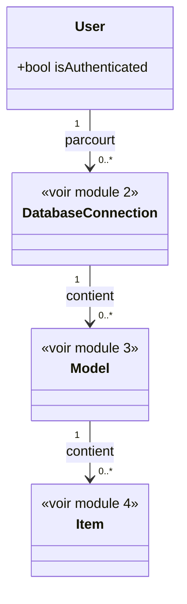

# 1. Architecture générale

## Contexte

Ce module décrit la vision d'ensemble du plug-in : un plug-in Laravel qui expose, dans l'application hôte où il est installé, un front HTML permettant de parcourir les bases de données de l'application, les modèles Eloquent qu'elles exposent, et les items de chaque modèle.

Le parcours fonctionnel suit une hiérarchie à trois niveaux, détaillée dans les modules dédiés :

Base de données (module 2) → Modèles (module 3) → Items (module 4).

Ce module porte les règles transversales qui s'appliquent à l'ensemble de ce parcours, plutôt qu'à un seul de ses niveaux — notamment le contrôle d'accès des utilisateurs.

## Modèle de données

## Contrôle d'accès des utilisateurs

<exigence id="EX-101">Tout utilisateur authentifié dans l'application hôte peut accéder à l'ensemble des fonctionnalités du plug-in (bases de données, modèles, items), sans restriction basée sur un rôle.</exigence>

<exigence id="EX-102">L'accès à un niveau de navigation (modèles d'une connexion, items d'un modèle) n'est conditionné que par la disponibilité de son niveau parent, jamais par les droits de l'utilisateur.</exigence>

<exigence id="EX-103">Une requête non authentifiée adressée à une route du plug-in (front ou API) reçoit une réponse d'erreur HTTP (401 ou 403), sans redirection vers une page de connexion.</exigence>

## Exposition et routage du plug-in

<exigence id="EX-104">Toutes les routes exposées par le plug-in (front et API) le sont sous un préfixe commun, dont la valeur est configurable par l'application hôte et dispose d'une valeur par défaut permettant un fonctionnement sans configuration explicite.</exigence>

<exigence id="EX-105">Les routes servant les appels API du plug-in sont distinguées des routes servant le front par un segment dédié sous ce préfixe commun.</exigence>

<exigence id="EX-106">Les assets compilés du front (SPA) sont mis à disposition de l'application hôte via le mécanisme standard de publication de package Laravel (vendor:publish), sans être servis dynamiquement par le plug-in.</exigence>

<limite>Si l'application hôte n'exécute pas la publication des assets après une mise à jour du plug-in, le front peut s'afficher avec une version obsolète des assets, sans que le plug-in ne détecte ni ne signale cette désynchronisation.</limite>
