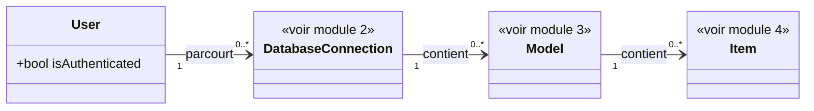

# 1. Architecture générale

## Contexte

Ce module décrit la vision d'ensemble du plug-in : un plug-in Laravel qui expose, dans l'application hôte où il est installé, un front HTML permettant de parcourir les bases de données de l'application, les modèles Eloquent qu'elles exposent, et les items de chaque modèle.

Le parcours fonctionnel suit une hiérarchie à trois niveaux, détaillée dans les modules dédiés :

Base de données (module 2) → Modèles (module 3) → Items (module 4).

Ce module porte les règles transversales qui s'appliquent à l'ensemble de ce parcours, plutôt qu'à un seul de ses niveaux — notamment le contrôle d'accès des utilisateurs.

## Modèle de données

## Contrôle d'accès des utilisateurs

<exigence id="EX-101">Tout utilisateur authentifié dans l'application hôte peut accéder à l'ensemble des fonctionnalités du plug-in (bases de données, modèles, items), sans restriction basée sur un rôle.</exigence>

<exigence id="EX-102">L'accès à un niveau de navigation (modèles d'une connexion, items d'un modèle) n'est conditionné que par la disponibilité de son niveau parent, jamais par les droits de l'utilisateur.</exigence>

<exigence id="EX-103">Une requête non authentifiée adressée à une route du plug-in (front ou API) reçoit une réponse d'erreur HTTP (401 ou 403), sans redirection vers une page de connexion.</exigence>

## Exposition et routage du plug-in

<exigence id="EX-104">Toutes les routes exposées par le plug-in (front et API) le sont sous un préfixe commun, dont la valeur est configurable par l'application hôte et dispose d'une valeur par défaut permettant un fonctionnement sans configuration explicite.</exigence>

<exigence id="EX-105">Les routes servant les appels API du plug-in sont distinguées des routes servant le front par un segment dédié sous ce préfixe commun.</exigence>

<exigence id="EX-106">Les assets compilés du front (SPA) sont mis à disposition de l'application hôte via le mécanisme standard de publication de package Laravel (vendor:publish), sans être servis dynamiquement par le plug-in.</exigence>

<limite>Si l'application hôte n'exécute pas la publication des assets après une mise à jour du plug-in, le front peut s'afficher avec une version obsolète des assets, sans que le plug-in ne détecte ni ne signale cette désynchronisation.</limite>

## Identité visuelle du front

<exigence id="EX-107">Le front du plug-in applique une palette de couleurs fixe, intégrée à son code, non personnalisable par l'application hôte.</exigence>

<exigence id="EX-108">Le front bascule automatiquement entre un mode clair et un mode sombre selon la préférence système signalée par le navigateur de l'utilisateur, sans contrôle manuel de bascule dans l'interface.</exigence>

<exigence id="EX-109">En mode clair, le texte principal utilise la couleur #2c3c4c et le fond de page la couleur #ecf8f9 ; en mode sombre, ces deux couleurs sont inversées (fond #2c3c4c, texte #ecf8f9).</exigence>

<exigence id="EX-110">La couleur principale #1c9a97 identifie, dans les deux modes, les éléments de marque mis en avant (actions principales, éléments actifs).</exigence>

<exigence id="EX-111">Les couleurs d'accent #4e4feb et #77f2a1 sont réservées, dans les deux modes, à la différenciation d'éléments secondaires de l'interface (ex. statuts, catégories visuelles), distincts de la couleur principale.</exigence>

<exigence id="EX-112">Une action interactive (bouton, lien, ligne de tableau navigable) adopte la couleur #fc9b50 lorsqu'elle est survolée par le curseur, dans les deux modes.</exigence>

<exigence id="EX-113">Toute paire de couleurs texte/fond utilisée dans l'interface respecte un contraste minimal conforme au niveau AA des WCAG 2.1 (ratio ≥ 4,5:1 pour le texte courant), y compris pour les couleurs de rôle principale/accent/survol dont seule la valeur en mode clair est fournie.</exigence>

<limite>Les valeurs de couleur des rôles principale, accent 1, accent 2 et survol au clic ne sont fournies que pour le mode clair ; leur variante en mode sombre est dérivée automatiquement (ex. ajustement de luminosité) sous la seule contrainte de contraste (EX-113), sans validation manuelle par un designer.</limite>

<limite>Un utilisateur dont l'environnement ne signale aucune préférence système exploitable affiche le front dans le mode par défaut retenu par le navigateur (généralement clair), aucun contrôle manuel n'étant prévu pour le forcer (EX-108).</limite>

## Internationalisation de l'IHM

<exigence id="EX-114">L'IHM du plug-in est disponible en français et en anglais.</exigence>

<exigence id="EX-115">La langue affichée au premier accès est le français, indépendamment de la langue du navigateur de l'utilisateur.</exigence>

<exigence id="EX-116">L'utilisateur peut changer la langue de l'IHM à tout moment via un sélecteur visible dans l'interface.</exigence>

<exigence id="EX-117">Le choix de langue effectué manuellement par l'utilisateur est mémorisé et réappliqué lors de ses visites suivantes.</exigence>

<exigence id="EX-118">Seuls les textes propres au plug-in (menus, libellés, boutons, messages système) sont traduits ; les messages d'erreur renvoyés tels quels par la base de données de l'application hôte (EX-417, EX-420) ne sont pas retraduits.</exigence>

<exigence id="EX-119">Si un texte de l'IHM ne dispose pas encore de traduction dans la langue sélectionnée, le français est utilisé en repli, plutôt qu'une clé technique brute ou un texte vide.</exigence>

<limite>Les données métier (noms de modèles Eloquent, noms de colonnes, valeurs d'items, messages d'erreur bruts de la base de données) ne sont pas traduites : seule l'enveloppe de l'IHM (menus, libellés, messages système du plug-in) l'est.</limite>
