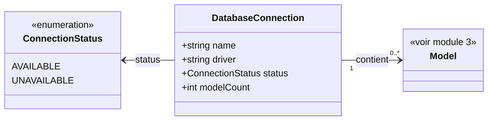

# 2. Base de données

## Contexte

Ce module permet à un utilisateur de l'application hôte de parcourir les connexions de bases de données configurées dans l'application Laravel où le plug-in est installé. C'est le point d'entrée du parcours : Base de données → Modèles (module 3) → Items (module 4).

Une « base de données », au sens métier de ce module, correspond à une **connexion Laravel configurée** (entrée de `config/database.php`), et non à une base physique découverte dynamiquement sur un serveur.

## Modèle de données

## Listing des connexions

<exigence id="EX-201">Le système liste toutes les connexions de bases de données configurées dans l'application hôte.</exigence>

<exigence id="EX-202">Pour chaque connexion listée, le système affiche : son nom, son driver (ex. mysql, pgsql), son statut de connexion (disponible / indisponible) et le nombre de modèles qu'elle contient.</exigence>

<exigence id="EX-203">Le système n'affiche pas d'informations de connexion sensibles (hôte, port, identifiants) dans la liste des bases.</exigence>

## Statut des connexions

<exigence id="EX-204">Si une connexion configurée est injoignable au moment de l'affichage, elle reste présente dans la liste avec un statut « indisponible », sans empêcher l'affichage des autres connexions.</exigence>

<exigence id="EX-205">Le nombre de modèles n'est calculé et affiché que pour les connexions au statut « disponible ».</exigence>

<exigence id="EX-206">Une connexion au statut « indisponible » ne peut pas être sélectionnée pour être parcourue plus avant (pas de navigation vers ses modèles).</exigence>

<exigence id="EX-207">La sélection d'une connexion disponible dans la liste navigue vers le listing des modèles de cette connexion (module 3).</exigence>

<exigence id="EX-208">Le statut de disponibilité de chaque connexion est recalculé à chaque affichage du listing des connexions, sans mise en cache entre deux chargements de page.</exigence>
