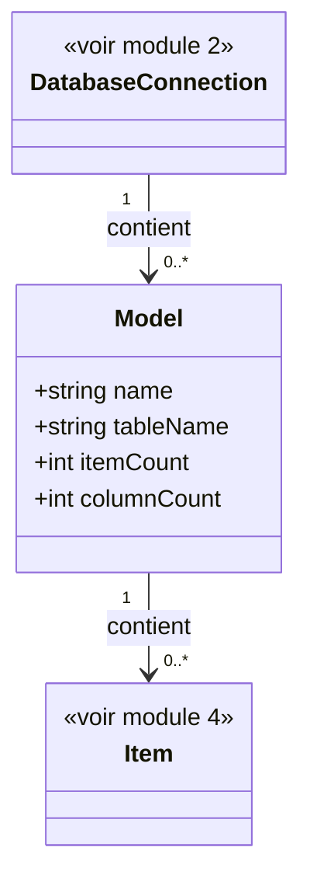

# 3. Modèles

## Contexte

Ce module permet à un utilisateur de l'application hôte de parcourir les modèles Eloquent déclarés dans l'application hôte et utilisant la connexion de base de données sélectionnée (module 2). Il s'agit de l'étape intermédiaire du parcours : Base de données (module 2) → Modèles (ce module) → Items (module 4).

Un « modèle », au sens métier de ce module, correspond à une classe Eloquent déclarée dans l'application hôte. Sa table associée n'est qu'un attribut du modèle, pas l'entité première du listing. Les tables techniques Laravel (migrations, jobs, sessions, cache, et équivalents) sont donc naturellement absentes de ce listing, puisqu'aucun modèle Eloquent déclaré ne leur correspond.

## Modèle de données

## Listing des modèles

<exigence id="EX-301">Le système liste les modèles Eloquent déclarés dans l'application hôte qui utilisent la connexion de base de données sélectionnée.</exigence>

<exigence id="EX-302">Pour chaque modèle listé, le système affiche : son nom, le nombre d'items (enregistrements) qu'il contient et le nombre de colonnes de sa table.</exigence>

<exigence id="EX-303">La sélection d'un modèle dans la liste navigue vers le listing de ses items (module 4).</exigence>

<exigence id="EX-304">L'utilisateur peut filtrer le listing des modèles par leurs noms ou ceux des tables.</exigence>

<limite>Si aucun modèle Eloquent déclaré n'utilise la connexion sélectionnée, le listing affiche un message indiquant l'absence de modèle disponible, sans erreur.</limite>

<limite>Si plusieurs modèles Eloquent déclarés correspondent à la même table, chacun est listé comme une entrée distincte.</limite>

La consultation de la structure d'une table (liste de ses colonnes et de leurs types) en dehors de la navigation vers ses items n'est pas couverte par ce module.
