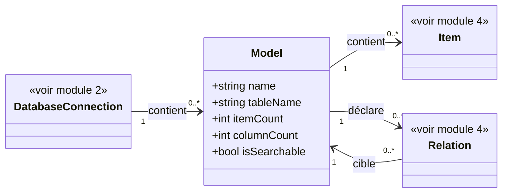

# 3. Modèles

## Contexte

Ce module permet à un utilisateur de l'application hôte de parcourir les modèles Eloquent déclarés dans l'application hôte et utilisant la connexion de base de données sélectionnée (module 2). Il s'agit de l'étape intermédiaire du parcours : Base de données (module 2) → Modèles (ce module) → Items (module 4).

Un « modèle », au sens métier de ce module, correspond à une classe Eloquent déclarée dans l'application hôte. Sa table associée n'est qu'un attribut du modèle, pas l'entité première du listing. Les tables techniques Laravel (migrations, jobs, sessions, cache, et équivalents) sont donc naturellement absentes de ce listing, puisqu'aucun modèle Eloquent déclaré ne leur correspond.

## Modèle de données

## Listing des modèles

<exigence id="EX-301">Le système liste les modèles Eloquent déclarés dans l'application hôte qui utilisent la connexion de base de données sélectionnée.</exigence>

Si aucun modèle Eloquent déclaré n'utilise la connexion sélectionnée, le listing affiche un message indiquant l'absence de modèle disponible, sans erreur.

Si plusieurs modèles Eloquent déclarés correspondent à la même table, chacun est listé comme une entrée distincte.

<exigence id="EX-302">Pour chaque modèle listé, le système affiche : son nom, le nombre d'items (enregistrements) qu'il contient et le nombre de colonnes de sa table.</exigence>

<exigence id="EX-303">La sélection d'un modèle dans la liste navigue vers le listing de ses items (module 4).</exigence>

<exigence id="EX-304">L'utilisateur peut filtrer le listing des modèles par leurs noms ou ceux des tables.</exigence>

<exigence id="EX-305">Les modèles listés sont lus à partir du code de l'application hôte (classes Eloquent déclarées), et non de la base de données.</exigence>

Si un modèle Eloquent déclaré référence une table absente de la base de données de sa connexion (ex. migration non exécutée), il reste listé avec un nombre d'items et de colonnes nul, plutôt que de provoquer une erreur — cohérent avec EX-305 (le listing part du code, pas de la base). La colonne table affiche une valeur nulle plutôt que le nom de table déclaré, pour ne pas donner l'impression d'une table réellement présente en base ; la ligne n'est pas navigable (limite à EX-303), l'absence de table ne laissant aucun listing d'items à ouvrir.

<exigence id="EX-312">Pour une table de grande taille, le nombre d'items affiché (EX-302) est une valeur approchée plutôt qu'un compte exact, sous une forme lisible : nombre brut si strictement inférieur à 10^3, suffixe « K » si strictement inférieur à 10^6, suffixe « G » si strictement inférieur à 10^9, suffixe « T » au-delà.</exigence>

L'approximation (EX-312) ne s'applique qu'à l'affichage du nombre d'items. Elle ne modifie pas le filtrage, le tri ou la pagination du listing des items (module 4), qui restent basés sur un compte exact.

La consultation de la structure d'une table (liste de ses colonnes et de leurs types) en dehors de la navigation vers ses items n'est pas couverte par ce module.

## Tri du listing des modèles

<exigence id="EX-313">Le listing des modèles peut être trié selon son nom, sa table, son nombre d'items ou son nombre de colonnes.</exigence>

En l'absence de tri actif, l'ordre d'affichage des modèles n'est pas garanti par une exigence propre à ce module.

Le tri par nombre d'items (EX-302) suit la même valeur, exacte ou approchée selon EX-312, que celle affichée dans le listing ; il n'y a pas de garantie d'ordre exact entre deux modèles dont le nombre d'items affiché est approché à une même valeur.

Un modèle dont la table est absente (limite EX-301/EX-305 ci-dessus) n'a pas de nom de table comparable : lors d'un tri par table, il reste toujours en fin de liste, quel que soit le sens de tri (croissant ou décroissant).

<exigence id="EX-314">Le tri porte sur un seul critère à la fois ; sélectionner un nouveau critère de tri remplace le précédent.</exigence>

<exigence id="EX-315">Le critère de tri actif et son ordre (croissant ou décroissant) sont indiqués visuellement dans l'en-tête de la colonne concernée.</exigence>

<exigence id="EX-316">Le tri s'applique après le filtre par nom ou table (EX-304), sur le sous-ensemble de modèles déjà filtré.</exigence>

## Visualisation des relations entre modèles

<exigence id="EX-306">Depuis la page listing des items d'un modèle (module 4), l'utilisateur peut accéder à une vue représentant les relations Eloquent déclarées par ce modèle vers d'autres modèles.</exigence>

<exigence id="EX-307">Cette vue représente les modèles liés sous la forme d'un diagramme à disposition radiale, généré à partir des relations Eloquent réellement déclarées par le modèle hôte (belongsTo, hasMany, belongsToMany, hasManyThrough, hasOne, morphMany, morphOne).</exigence>

<exigence id="EX-308">Le diagramme se limite au modèle courant et aux modèles qu'il relie directement, sans remonter les relations propres à ces modèles liés.</exigence>

<exigence id="EX-309">Chaque relation représentée dans le diagramme indique son nom et sa multiplicité, sans détailler son type technique Eloquent (belongsTo, hasMany...) ni les colonnes des modèles.</exigence>

<exigence id="EX-310">Le diagramme dispose le modèle courant visuellement au centre et les modèles liés autour de lui, sur un même niveau, selon une répartition en étoile plutôt qu'une hiérarchie verticale ou en pyramide.</exigence>

Si le modèle courant ne déclare aucune relation vers un autre modèle, la vue l'indique explicitement plutôt que d'afficher un diagramme vide sans explication.

Si une relation cible un modèle qui n'est pas déclaré ou qui appartient à une connexion indisponible (mêmes limites que la résolution de clé étrangère en module 4), le modèle cible est représenté avec une indication d'indisponibilité plutôt que d'être omis silencieusement.

La répartition en étoile s'applique quel que soit le sens de la relation (le modèle courant source ou cible de la relation). Un modèle lié n'est pas positionné différemment selon qu'il est référencé par le modèle courant ou qu'il référence le modèle courant.

<limite>Le nombre de modèles liés représentés simultanément autour du modèle courant n'est pas plafonné ; un modèle déclarant un grand nombre de relations peut produire un diagramme dense, sans mécanisme de regroupement ou de pagination visuelle prévu.</limite>

<exigence id="EX-311">Depuis le diagramme, cliquer sur un modèle lié navigable ouvre le listing de ses items (module 4).</exigence>

Le modèle courant, représenté au centre du diagramme, n'est pas cliquable : l'utilisateur consulte déjà son listing d'items.

Un modèle lié non navigable ne réagit pas au clic, cohérent avec son indisponibilité.
