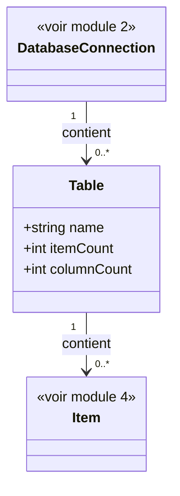

# 3. Tables

## Contexte

Ce module permet à un utilisateur de l'application hôte de parcourir les tables/modèles présents dans une connexion de base de données sélectionnée (module 2). Il s'agit de l'étape intermédiaire du parcours : Base de données (module 2) → Tables/Modèles (ce module) → Items (module 4).

Une « table », au sens métier de ce module, correspond à un modèle/table exposé par la connexion sélectionnée.

## Modèle de données

## Listing des tables

<exigence id="EX-301">Le système liste les tables correspondant à un modèle Eloquent déclaré dans l'application hôte, parmi les tables de la connexion de base de données sélectionnée ; les tables techniques Laravel (migrations, jobs, sessions, cache, failed_jobs, et équivalents) ne sont pas listées.</exigence>

<exigence id="EX-302">Pour chaque table/modèle listé, le système affiche : son nom, le nombre d'items (enregistrements) qu'il contient et le nombre de colonnes qu'il possède.</exigence>

<exigence id="EX-303">La sélection d'une table/modèle dans la liste navigue vers le listing de ses items (module 4).</exigence>

<exigence id="EX-304">L'utilisateur peut filtrer le listing des tables par nom.</exigence>

<limite>Si la connexion sélectionnée ne contient aucune table/modèle éligible (après exclusion des tables techniques), le listing affiche un message indiquant l'absence de table disponible, sans erreur.</limite>

La consultation de la structure d'une table (liste de ses colonnes et de leurs types) en dehors de la navigation vers ses items n'est pas couverte par ce module.
