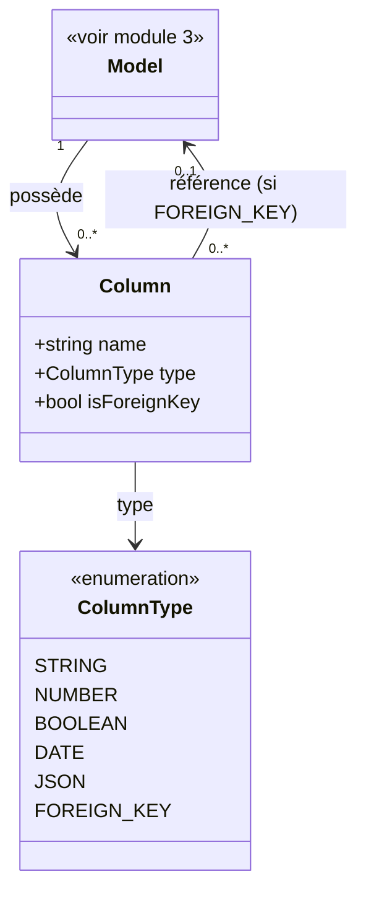
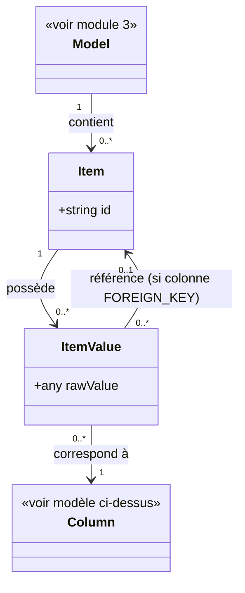

# 4. Items

## Contexte

Ce module permet à un utilisateur de l'application hôte de parcourir, créer, modifier et supprimer les items (enregistrements) d'un modèle sélectionné (module 3). Il s'agit de la dernière étape du parcours : Base de données (module 2) → Modèles (module 3) → Items (ce module).

Un « item », au sens métier de ce module, correspond à un enregistrement d'un modèle. Chaque item porte une valeur pour chacune des colonnes définies par ce modèle.

## Modèle de données

## Fidélité à la modélisation Eloquent

<exigence id="EX-422">Les colonnes d'un modèle sont lues à partir du code de l'application hôte (attributs Eloquent), seuls leurs types pouvant être déduits du schéma de la base de données.</exigence>

<exigence id="EX-423">Les relations entre modèles (clés étrangères) s'appuient sur la modélisation Eloquent déclarée dans l'application hôte plutôt que sur les seules contraintes de la base de données.</exigence>

<exigence id="EX-424">Toute création, modification ou suppression d'un item déclenche les événements Eloquent correspondants (creating/created, updating/updated, deleting/deleted) du modèle hôte.</exigence>

L'écriture, par des instances Eloquent réelles plutôt que par de simples enregistrements en base, vise à permettre des actions manuelles ponctuelles respectant les règles métier déclenchées par ces événements. Les développeurs utilisant Laravel Scout, en particulier, évitent ainsi toute désynchronisation du cache de recherche lors d'une modification via ce module.

## Listing des items

<exigence id="EX-401">Le système liste les items d'un modèle sélectionné sous forme de tableau, une ligne par item.</exigence>

<exigence id="EX-402">Pour chaque item listé, le système affiche un aperçu des valeurs de ses colonnes principales.</exigence>

<exigence id="EX-403">Le listing des items est paginé ; l'utilisateur peut naviguer entre les pages.</exigence>

<limite>Le choix des colonnes considérées comme « principales » dans l'aperçu du listing n'est pas tranché.</limite>

<exigence id="EX-404">Si le modèle sélectionné ne contient aucun item, le listing affiche un message indiquant l'absence d'item disponible, sans erreur.</exigence>

## Consultation du détail d'un item

<exigence id="EX-405">La sélection d'un item dans le listing navigue vers sa fiche détail.</exigence>

<exigence id="EX-406">La fiche détail d'un item affiche la valeur de toutes ses colonnes.</exigence>

<exigence id="EX-407">Chaque valeur de colonne est affichée selon un rendu adapté à son type (texte, nombre, date, booléen, JSON).</exigence>

<exigence id="EX-408">Une valeur de colonne de type clé étrangère est affichée comme un lien de navigation vers l'item référencé, dans son propre modèle.</exigence>

<exigence id="EX-409">Une valeur de colonne nulle est affichée avec un rendu distinct d'une valeur renseignée (y compris une chaîne vide).</exigence>

<exigence id="EX-410">Si une clé étrangère référence un item supprimé ou inexistant, la valeur est affichée sans lien de navigation, accompagnée d'un indicateur signalant que l'item référencé est introuvable.</exigence>

<exigence id="EX-411">Depuis la fiche détail d'un item, l'utilisateur peut revenir au listing des items du modèle.</exigence>

## Création et modification d'un item

<exigence id="EX-412">L'utilisateur peut créer un nouvel item dans un modèle, en renseignant une valeur pour chacune de ses colonnes.</exigence>

<exigence id="EX-413">L'utilisateur peut modifier la valeur des colonnes d'un item existant.</exigence>

<exigence id="EX-414">Le formulaire de saisie d'une colonne est adapté à son type (champ texte, champ numérique, sélecteur de date, case à cocher, éditeur JSON).</exigence>

<exigence id="EX-415">La modification d'une valeur de colonne de type clé étrangère se fait par sélection d'un item existant dans le modèle référencé.</exigence>

<exigence id="EX-416">Les colonnes techniques non éditables (clé primaire, horodatages de création/modification) sont affichées en lecture seule dans le formulaire.</exigence>

<exigence id="EX-417">Le formulaire de saisie remonte à l'utilisateur les erreurs de validation renvoyées par les contraintes définies sur la colonne (obligatoire, unicité, format), sans redéfinir ces règles de validation au niveau du plug-in.</exigence>

<exigence id="EX-421">Seules les colonnes fillable (mass-assignable, au sens `$fillable`/`$guarded` d'Eloquent) du modèle hôte peuvent être renseignées à la création ou modifiées via ce module. Une colonne non fillable, hors colonnes techniques (EX-416), est traitée en lecture seule au même titre.</exigence>

## Suppression d'un item

<exigence id="EX-418">L'utilisateur peut supprimer un item existant.</exigence>

<exigence id="EX-419">Une confirmation est demandée à l'utilisateur avant toute suppression d'item.</exigence>

<exigence id="EX-420">Si la suppression d'un item échoue parce qu'il est référencé comme clé étrangère par d'autres items, le système affiche à l'utilisateur, après confirmation, l'erreur d'intégrité référentielle renvoyée par la base de données plutôt que d'appliquer la suppression.</exigence>

<limite>La suppression ou la modification en masse de plusieurs items simultanément n'est pas couverte par ce module.</limite>

Le contrôle d'accès des utilisateurs à ce module est traité de façon transversale dans le module 1 (Architecture générale, EX-101 et EX-102).
