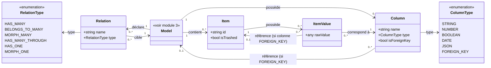
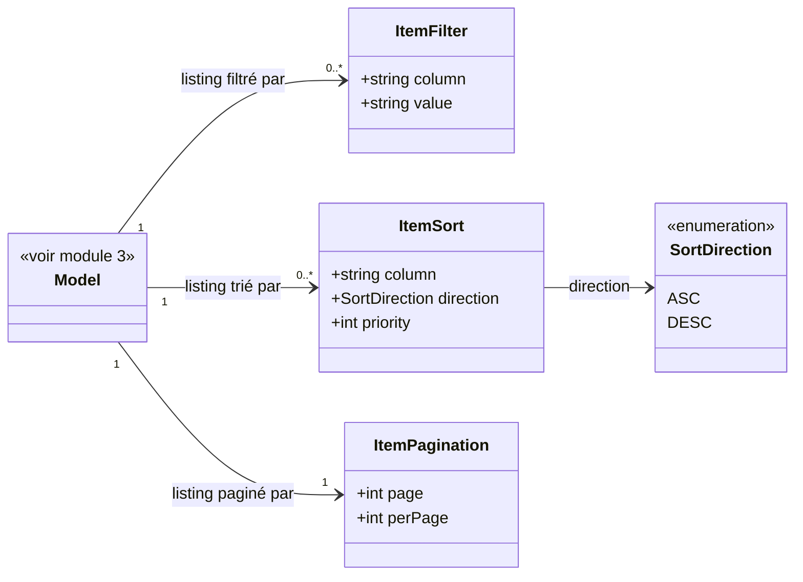

# 4. Items

## Contexte

Ce module permet à un utilisateur de l'application hôte de parcourir, créer, modifier et supprimer les items (enregistrements) d'un modèle sélectionné (module 3). Il s'agit de la dernière étape du parcours : Base de données (module 2) → Modèles (module 3) → Items (ce module).

Un « item », au sens métier de ce module, correspond à un enregistrement d'un modèle. Chaque item porte une valeur pour chacune des colonnes définies par ce modèle.

## Modèle de données

`Item.isTrashed` ne prend une valeur pertinente que pour un modèle hôte utilisant le trait Eloquent `SoftDeletes` ; il vaut toujours `false` pour les autres (cf. « Gestion des items soft-deleted » ci-dessous).

`ItemFilter.column`/`ItemSort.column` désignent une colonne parmi celles exposées par le modèle (EX-422). `ItemSort.priority` détermine l'ordre d'application lorsque plusieurs colonnes sont triées simultanément (cf. « Filtrage et tri du listing des items » ci-dessous). `ItemPagination.perPage` est restreint à un ensemble de valeurs prédéfinies (cf. « Pagination du listing des items » ci-dessous).

## Fidélité à la modélisation Eloquent

<exigence id="EX-422">Les colonnes d'un modèle sont lues à partir du code de l'application hôte (attributs Eloquent), seuls leurs types pouvant être déduits du schéma de la base de données.</exigence>

<exigence id="EX-423">Les relations entre modèles (clés étrangères) s'appuient sur la modélisation Eloquent déclarée dans l'application hôte plutôt que sur les seules contraintes de la base de données.</exigence>

<exigence id="EX-424">Toute création, modification ou suppression d'un item déclenche les événements Eloquent correspondants (creating/created, updating/updated, deleting/deleted) du modèle hôte.</exigence>

L'écriture, par des instances Eloquent réelles plutôt que par de simples enregistrements en base, vise à permettre des actions manuelles ponctuelles respectant les règles métier déclenchées par ces événements. Les développeurs utilisant Laravel Scout, en particulier, évitent ainsi toute désynchronisation du cache de recherche lors d'une modification via ce module.

## Listing des items

<exigence id="EX-401">Le système liste les items d'un modèle sélectionné sous forme de tableau, une ligne par item.</exigence>

<exigence id="EX-402">Pour chaque item listé, le système affiche un aperçu des valeurs de ses colonnes principales.</exigence>

<exigence id="EX-403">Le listing des items est paginé ; l'utilisateur peut naviguer entre les pages.</exigence>

<limite>Le choix des colonnes considérées comme « principales » dans l'aperçu du listing n'est pas tranché.</limite>

<exigence id="EX-404">Si le modèle sélectionné ne contient aucun item, le listing affiche un message indiquant l'absence d'item disponible, sans erreur.</exigence>

<limite>Si la table du modèle sélectionné n'existe pas réellement dans la base de données de sa connexion (ex. migration non exécutée), le listing se comporte comme pour un modèle sans aucun item (EX-404), plutôt que de provoquer une erreur.</limite>

## Pagination du listing des items

<exigence id="EX-452">L'utilisateur peut choisir le nombre de lignes affichées par page du listing, parmi un ensemble de valeurs prédéfinies.</exigence>

<exigence id="EX-453">L'utilisateur peut accéder directement à n'importe quelle page du listing, sans devoir naviguer page par page.</exigence>

<exigence id="EX-454">Si le numéro de page demandé est inférieur à 1 ou supérieur au nombre de pages disponibles, le système affiche respectivement la première ou la dernière page, sans afficher d'erreur.</exigence>

<exigence id="EX-455">Le nombre de lignes par page choisi par l'utilisateur est mémorisé et réappliqué lors de ses accès ultérieurs à un listing paginé.</exigence>

<exigence id="EX-456">Cette mémorisation est propre à chaque contexte de listing (un modèle donné en listing standard, une relation donnée en tableau d'objets liés) : elle ne partage pas une valeur unique entre tous les listings de l'utilisateur.</exigence>

Cette logique de pagination (EX-452 à EX-456) est celle référencée par le listing standard (EX-403) et les tableaux d'objets liés (EX-429) : le choix du nombre de lignes par page et l'accès direct à une page sont donc disponibles sur chacun de ces listings, chacun gérant sa propre page courante et son propre nombre de lignes par page indépendamment des autres.

<limite>L'ensemble des valeurs prédéfinies proposées pour le nombre de lignes par page (ex. 10/25/50/100) n'est pas figé par cette exigence ; leur choix est un point d'implémentation, sous réserve de rester raisonnable au regard des performances.</limite>

## Filtrage et tri du listing des items

<exigence id="EX-432">Le listing des items d'un modèle peut être filtré, côté serveur, par une valeur fournie pour une ou plusieurs de ses colonnes.</exigence>

<exigence id="EX-433">Pour une colonne de type texte, le filtre retient les items dont la valeur contient la valeur fournie, indépendamment de la casse ; pour les autres types de colonne, le filtre retient les items dont la valeur est strictement égale à la valeur fournie.</exigence>

<exigence id="EX-434">Lorsque plusieurs filtres de colonnes sont appliqués simultanément, seuls les items satisfaisant l'ensemble de ces filtres sont retenus.</exigence>

<exigence id="EX-435">Le listing des items peut être trié selon une ou plusieurs de ses colonnes, chacune associée à un ordre croissant ou décroissant.</exigence>

<exigence id="EX-436">Lorsque le tri porte sur plusieurs colonnes, celles-ci sont appliquées selon un ordre de priorité déterminé par l'utilisateur.</exigence>

<limite>Le filtre et le tri portent sur l'ensemble des colonnes exposées par le modèle (EX-422), indépendamment de la notion de colonnes « principales » du listing compact, dont la sélection reste un point ouvert (EX-402).</limite>

<limite>Le filtre et le tri définis par cette exigence ne s'appliquent qu'au listing standard des items d'un modèle ; les tableaux d'objets liés (EX-425 à EX-431) n'en bénéficient pas.</limite>

## Consultation du détail d'un item

<exigence id="EX-405">La sélection d'un item dans le listing navigue vers sa fiche détail.</exigence>

<exigence id="EX-406">La fiche détail d'un item affiche la valeur de toutes ses colonnes.</exigence>

<exigence id="EX-407">Chaque valeur de colonne est affichée selon un rendu adapté à son type (texte, nombre, date, booléen, JSON).</exigence>

<exigence id="EX-408">Une valeur de colonne de type clé étrangère est affichée comme un lien de navigation vers l'item référencé, dans son propre modèle.</exigence>

<exigence id="EX-409">Une valeur de colonne nulle est affichée avec un rendu distinct d'une valeur renseignée (y compris une chaîne vide).</exigence>

<exigence id="EX-410">Si une clé étrangère référence un item supprimé ou inexistant, la valeur est affichée sans lien de navigation, accompagnée d'un indicateur signalant que l'item référencé est introuvable.</exigence>

<limite>La résolution d'une clé étrangère en lien de navigation (EX-408) ne recherche le modèle référencé que parmi ceux déclarés sur la même connexion que l'item consulté : une clé étrangère pointant vers une autre connexion, même disponible, n'est jamais résolue en lien navigable et suit le même traitement que EX-410.</limite>

<exigence id="EX-411">Depuis la fiche détail d'un item, l'utilisateur peut revenir au listing des items du modèle.</exigence>

## Disposition en colonnes de la fiche détail et du formulaire

<exigence id="EX-448">La fiche détail d'un item (EX-406 à EX-410) et son formulaire de création/modification (EX-412 à EX-417) répartissent les champs de colonnes sur plusieurs colonnes visuelles, de façon à occuper au mieux la largeur disponible de l'écran.</exigence>

<exigence id="EX-449">Le nombre de colonnes visuelles se recalcule selon la largeur disponible de l'écran, jusqu'à un repli sur une colonne unique sur les écrans étroits.</exigence>

<exigence id="EX-450">Un champ dont le rendu nécessite un espace vertical important, notamment l'éditeur JSON (EX-414) et une colonne de texte long (type SQL text/mediumtext/longtext, par opposition à varchar/char), occupe toute la largeur de la grille plutôt que de partager une colonne visuelle avec un autre champ.</exigence>

<exigence id="EX-463">Une colonne de texte long (type SQL text/mediumtext/longtext, par opposition à varchar/char) est rendue via un éditeur multiligne plutôt qu'un simple champ texte, dans le formulaire de création/modification.</exigence>

<exigence id="EX-451">L'ordre de répartition des champs dans la grille suit l'ordre des colonnes tel qu'exposé par le modèle (EX-422), sans réordonnancement propre à l'affichage en colonnes, à l'exception des champs occupant toute la largeur de la grille (EX-450) : ceux-ci sont replacés en fin de grille, après tous les autres champs, pour éviter qu'un champ pleine largeur au milieu de la répartition n'interrompe les rangées suivantes.</exigence>

<limite>Le nombre exact de colonnes affichées selon la largeur d'écran (points de rupture, largeur minimale d'un champ) n'est pas figé par cette exigence : c'est un choix d'implémentation front, du moment que la largeur disponible est effectivement occupée.</limite>

<limite>Cette disposition en colonnes ne s'applique qu'aux champs propres de l'item ; les tableaux d'objets liés (EX-425 à EX-431), affichés sous la fiche détail, conservent leur disposition pleine largeur actuelle.</limite>

## Affichage des objets liés à un item

<exigence id="EX-425">La fiche détail d'un item affiche, sous les valeurs de ses colonnes, un tableau distinct pour chaque relation Eloquent déclarée par le modèle hôte vers un autre modèle (hasMany, belongsToMany, morphMany, hasManyThrough, hasOne, morphOne).</exigence>

<exigence id="EX-426">Le titre de chaque tableau reprend le nom de la relation tel que déclaré dans le modèle hôte (nom de la méthode Eloquent), afin de distinguer plusieurs relations pointant vers un même modèle lié.</exigence>

<exigence id="EX-427">Chaque tableau affiche un aperçu des valeurs des colonnes principales des objets liés, selon la même logique d'aperçu que le listing standard d'un modèle (EX-402).</exigence>

<exigence id="EX-428">La sélection d'une ligne dans un tableau d'objets liés navigue vers la fiche détail de l'item correspondant, dans son propre modèle.</exigence>

<exigence id="EX-429">Chaque tableau d'objets liés est paginé selon la même logique de pagination que le listing standard d'un modèle (EX-403).</exigence>

<exigence id="EX-430">Si une relation ne retourne aucun objet lié, son tableau affiche un message indiquant l'absence d'élément, sans erreur.</exigence>

<exigence id="EX-431">Si le modèle ciblé par une relation appartient à une connexion indisponible, le tableau correspondant affiche une indication d'indisponibilité, sans lien de navigation vers ses lignes.</exigence>

<limite>Les attributs propres à la table pivot d'une relation belongsToMany (ex. une date d'association, une quantité) ne sont pas affichés dans le tableau des objets liés : seules les colonnes du modèle lié sont couvertes.</limite>

<limite>La création ou la suppression rapide d'un objet lié directement depuis ce tableau n'est pas couverte par cette fonctionnalité ; ces actions passent par la navigation vers la fiche de l'item lié ou vers le listing de son modèle (module 3/4).</limite>

## Création et modification d'un item

<exigence id="EX-412">L'utilisateur peut créer un nouvel item dans un modèle, en renseignant une valeur pour chacune de ses colonnes.</exigence>

<exigence id="EX-413">L'utilisateur peut modifier la valeur des colonnes d'un item existant.</exigence>

<exigence id="EX-414">Le formulaire de saisie d'une colonne est adapté à son type (champ texte, champ numérique, sélecteur de date, case à cocher, éditeur JSON).</exigence>

<exigence id="EX-415">La modification d'une valeur de colonne de type clé étrangère se fait par sélection d'un item existant dans le modèle référencé.</exigence>

## Restrictions d'édition des colonnes

<exigence id="EX-416">Les colonnes techniques non éditables (clé primaire, horodatages de création/modification) sont affichées en lecture seule dans le formulaire.</exigence>

<exigence id="EX-417">Le formulaire de saisie remonte à l'utilisateur les erreurs de validation renvoyées par les contraintes définies sur la colonne (obligatoire, unicité, format), sans redéfinir ces règles de validation au niveau du plug-in.</exigence>

<exigence id="EX-421">Seules les colonnes fillable (mass-assignable, au sens `$fillable`/`$guarded` d'Eloquent) du modèle hôte peuvent être renseignées à la création ou modifiées via ce module.</exigence>

<exigence id="EX-464">Une colonne non fillable, hors colonnes techniques (EX-416), est traitée en lecture seule au même titre que ces dernières.</exigence>

## Suppression d'un item

<exigence id="EX-418">L'utilisateur peut supprimer un item existant.</exigence>

<exigence id="EX-419">Une confirmation est demandée à l'utilisateur avant toute suppression d'item.</exigence>

<exigence id="EX-420">Si la suppression d'un item échoue parce qu'il est référencé comme clé étrangère par d'autres items, le système affiche à l'utilisateur, après confirmation, l'erreur d'intégrité référentielle renvoyée par la base de données plutôt que d'appliquer la suppression.</exigence>

<limite>La suppression ou la modification en masse de plusieurs items simultanément n'est pas couverte par ce module.</limite>

## Gestion des items soft-deleted

<exigence id="EX-437">Pour un modèle utilisant le trait Eloquent SoftDeletes, le listing standard des items n'affiche par défaut que les items non supprimés.</exigence>

<exigence id="EX-438">L'utilisateur peut activer un filtre affichant les items soft-deleted en complément des items actifs, ou les items soft-deleted exclusivement.</exigence>

<exigence id="EX-439">Un item soft-deleted affiché est signalé par un indicateur visuel distinctif, dans le listing comme sur sa fiche détail.</exigence>

<exigence id="EX-440">Depuis la fiche détail d'un item soft-deleted, l'utilisateur peut le restaurer, ce qui annule sa suppression.</exigence>

<exigence id="EX-441">Depuis la fiche détail d'un item soft-deleted, l'utilisateur peut le supprimer définitivement (suppression physique), cette action étant distincte de la suppression standard (EX-418).</exigence>

<exigence id="EX-442">Une confirmation est demandée à l'utilisateur avant toute suppression définitive d'un item, en complément de la confirmation déjà requise pour la suppression standard (EX-419).</exigence>

<exigence id="EX-443">Pour un modèle n'utilisant pas le trait SoftDeletes, aucune de ces fonctions (filtre, indicateur, restauration, suppression définitive) n'est proposée : la suppression standard (EX-418) y reste physique et immédiate.</exigence>

<limite>Le filtre d'affichage des items soft-deleted et les actions de restauration/suppression définitive ne s'appliquent qu'au listing standard et à la fiche détail d'un item ; les tableaux d'objets liés (EX-425 à EX-431) affichent les objets liés tels que renvoyés par la relation Eloquent, sans filtre de visibilité dédié.</limite>

## Mise à jour à la demande du cache de recherche Scout

<exigence id="EX-444">Pour un modèle utilisant le trait Laravel Scout Searchable, la fiche détail d'un item propose une action déclenchant la mise à jour de son entrée dans l'index de recherche Scout.</exigence>

<exigence id="EX-445">Cette action invoque le mécanisme de synchronisation Scout du modèle hôte (méthode `searchable()` de l'item), sans réimplémenter de logique d'indexation propre au plug-in.</exigence>

<exigence id="EX-446">L'utilisateur reçoit une confirmation visuelle du succès ou de l'échec de la mise à jour de l'index.</exigence>

<exigence id="EX-447">Pour un modèle n'utilisant pas le trait Searchable, cette action n'est pas proposée.</exigence>

<limite>Cette exigence ne couvre pas la réindexation en masse de tous les items d'un modèle : seule la mise à jour d'un item à la fois est couverte.</limite>

<limite>Si le pilote Scout configuré par l'application hôte est asynchrone (mise en file d'attente), la mise à jour effective de l'index peut ne pas être immédiate ; le plug-in ne fait que déclencher la synchronisation, sans en garantir le délai de traitement.</limite>

Le contrôle d'accès des utilisateurs à ce module est traité de façon transversale dans le module 1 (Architecture générale, EX-101 et EX-102).
